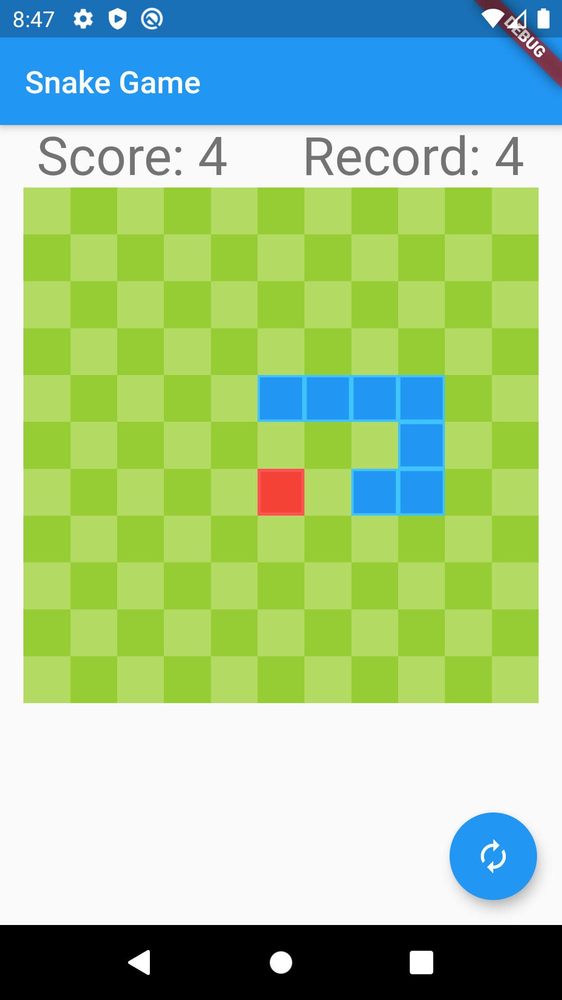

# Snake Game

## Getting Started

This project is a starting point for a Flutter application.

A few resources to get you started if this is your first Flutter project:

- [Lab: Write your first Flutter app](https://flutter.dev/docs/get-started/codelab)
- [Cookbook: Useful Flutter samples](https://flutter.dev/docs/cookbook)

For help getting started with Flutter, view our
[online documentation](https://flutter.dev/docs), which offers tutorials,
samples, guidance on mobile development, and a full API reference.

## ScreenShot (_in game_)

  
  
  
  
  

## Usage

  
  

- snake가 좌우로 움직일 때는 화면이 상하로 나뉘어지고 터치하는 쪽으로 snake가 방향을 전환한다.
- snake가 상하로 움직일 때는 화면이 좌우로 나뉘어지고 터치하는 쪽으로 snake가 방향을 전환한다.
- 빨간색 사과를 먹으면 진행 방향 쪽으로 길이가 한 칸 길어진다.
- 벽이나 자기 자신에게 부딪치면 게임이 끝난다.
- Score는 현재 자신이 먹은 빨간색 사과의 개수를 나타낸다.
- Record는 사용자의 최고 점수를 나타낸다.
